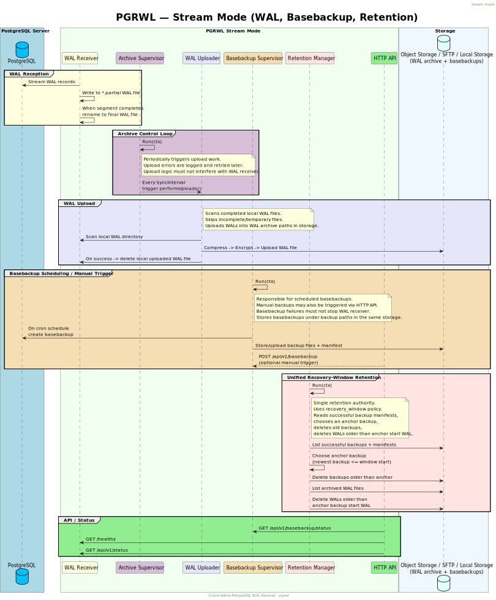

# pgrwl

> Cloud-native continuous backup for PostgreSQL in a single binary.

[](https://github.com/pgrwl/pgrwl/blob/master/LICENSE)
[](https://goreportcard.com/report/github.com/pgrwl/pgrwl)
[](https://pkg.go.dev/github.com/pgrwl/pgrwl)
[](https://github.com/pgrwl/pgrwl/actions/workflows/ci.yml?query=branch:master)
[](https://github.com/pgrwl/pgrwl/issues)
[](https://github.com/pgrwl/pgrwl/blob/master/go.mod#L3)
[](https://github.com/pgrwl/pgrwl/releases/latest)
[](https://github.com/pgrwl/pgrwl/issues?q=is%3Aissue+is%3Aopen+sort%3Aupdated-desc+label%3A%22good+first+issue%22)

**pgrwl** is a Go-based PostgreSQL backup tool for continuous WAL archiving and scheduled base backups. It streams
PostgreSQL WALs and base backups into local or remote storage, with optional compression, encryption, retention, and
monitoring built in.

It is designed for disaster recovery and PITR (Point-in-Time Recovery), with a focus on low operational complexity:
no extra backup tools, no external schedulers, and no dependency chain to operate - just one binary, PostgreSQL, and
your chosen storage backend.

For WAL streaming, `pgrwl` behaves as a container-friendly alternative to `pg_receivewal`, supporting streaming
replication, automatic reconnects, partial WAL files, archive upload, retention, and restore integration.

---

## Table of Contents

- [About](#about)
- [Operating Modes](#operating-modes)
- [Usage](#usage)
    - [Kubernetes Quick Start](#kubernetes-quick-start)
    - [Docker Compose Quick Start](#docker-compose-quick-start)
    - [Restore Command](#restore-command)
- [Configuration Reference](#configuration-reference)
- [Installation](#installation)
    - [Docker images](#docker-images)
    - [Helm Chart](#helm-chart)
    - [Manual Installation](#manual-installation)
    - [Installation script for Unix-Based OS](#installation-script-for-unix-based-os)
    - [Package-Based installation](#package-based-installation)
        - [Debian](#debian)
        - [Alpine Linux](#alpine-linux)
- [Disaster Recovery Use Cases](#disaster-recovery-use-cases)
- [Architecture](#architecture)
    - [Design Notes](#design-notes)
    - [Durability \& `fsync`](#durability--fsync)
    - [Why Not `archive_command`?](#why-not-archive_command)
- [Contributing](#contributing)
- [Links](#links)
- [License](#license)

---

## About

Reliable PostgreSQL backups come with moving parts: WAL handling, scheduled jobs, compression, remote storage, 
and retention - each one more thing to configure, monitor, and debug.

`pgrwl` replaces that entire stack with a single process: WAL streaming, scheduled base backups,
compression, encryption, S3/SFTP upload, retention management, and a restore helper - all driven
by one config file. No external schedulers, no backup tool chains, no extra services to operate.

It implements the streaming replication protocol directly (not `archive_command`), which means
it supports replication slots, `*.partial` WAL files, and synchronous replication acknowledgment -
enabling **RPO=0** in high-durability setups.

**Basic dashboard**


**Architecture**



---

## Usage

**[`^        back to top        ^`](#table-of-contents)**

### Kubernetes Quick Start

See [examples](https://github.com/pgrwl/pgrwl/tree/master/examples/k8s-quick-start)

### Docker-Compose Quick Start

#### Start the stack

Expand the `docker-compose.yml` section below, copy the file content into `docker-compose.yml`,
then run: `docker compose up -d`

<details>

<summary>docker-compose.yml</summary>

```yaml
# docker-compose.yml
#
# Local end-to-end pgrwl playground.
#
# It starts:
#   - PostgreSQL primary
#   - WAL traffic generator
#   - pgrwl receiver
#   - pgrwl backup worker
#   - pgrwl dashboard UI
#   - SeaweedFS S3-compatible storage
#   - SeaweedFS admin dashboard
#
# Useful URLs:
#   pgrwl dashboard:       http://localhost:8585/ui
#   SeaweedFS admin:       http://localhost:23646
#   SeaweedFS filer:       http://localhost:8888
#   SeaweedFS bucket view: http://localhost:8888/buckets/backups/
#   SeaweedFS S3 API:      http://localhost:8333
#   PostgreSQL:            localhost:15432

services:
  # ---------------------------------------------------------------------------
  # PostgreSQL primary
  # ---------------------------------------------------------------------------

  pg-primary:
    image: postgres:17.9-bookworm
    container_name: pg-primary
    restart: unless-stopped
    environment:
      TZ: "Asia/Aqtau"
      POSTGRES_USER: postgres
      POSTGRES_PASSWORD: postgres
    ports:
      - "15432:5432"
    volumes:
      - pg-primary-data:/var/lib/postgresql/17/main
    command: >
      -c config_file=/etc/postgresql/postgresql.conf
      -c hba_file=/etc/postgresql/pg_hba.conf
    configs:
      - source: pg_hba.conf
        target: /etc/postgresql/pg_hba.conf
        mode: "0755"
      - source: postgresql.conf
        target: /etc/postgresql/postgresql.conf
        mode: "0755"
    healthcheck:
      test: [ "CMD", "pg_isready", "-U", "postgres" ]
      interval: 2s
      timeout: 2s
      retries: 10

  # ---------------------------------------------------------------------------
  # WAL generator
  #
  # This service continuously writes data into PostgreSQL and forces WAL switches.
  # It exists only to make local testing visible and active.
  # ---------------------------------------------------------------------------

  wal-generator:
    image: postgres:17.9-bookworm
    container_name: wal-generator
    restart: unless-stopped
    environment:
      TZ: "Asia/Aqtau"

      PGHOST: pg-primary
      PGPORT: 5432
      PGUSER: postgres
      PGPASSWORD: postgres
      PGDATABASE: postgres

      INTERVAL_SECONDS: 5
    configs:
      - source: wal-generator.sh
        target: /scripts/generate-wal.sh
        mode: "0755"
    command:
      - /bin/sh
      - /scripts/generate-wal.sh
    depends_on:
      pg-primary:
        condition: service_healthy

  # ---------------------------------------------------------------------------
  # pgrwl receiver
  #
  # Streams PostgreSQL WAL files and uploads completed WAL segments to S3.
  # ---------------------------------------------------------------------------

  pgrwl-receive:
    container_name: pgrwl-receive
    image: quay.io/pgrwl/pgrwl:1.0.34
    restart: unless-stopped
    environment:
      TZ: "Asia/Aqtau"
      PGHOST: pg-primary
      PGPORT: 5432
      PGUSER: postgres
      PGPASSWORD: postgres
    ports:
      - "7070:7070"
    command: daemon -c /etc/pgrwl-config.yaml -m receive
    configs:
      - source: pgrwl-config.yaml
        target: /etc/pgrwl-config.yaml
        mode: "0755"
    volumes:
      - pgrwl-wal-archive-data:/mnt
    depends_on:
      pg-primary:
        condition: service_healthy
      seaweedfs-provision:
        condition: service_completed_successfully

  # ---------------------------------------------------------------------------
  # pgrwl dashboard
  #
  # Reads receiver/backup status over the internal Docker Compose network.
  # Open: http://localhost:8585/ui
  # ---------------------------------------------------------------------------

  pgrwl-ui:
    container_name: pgrwl-ui
    image: quay.io/pgrwl/ui:1.0.34
    restart: unless-stopped
    environment:
      TZ: "Asia/Aqtau"
      PGRWL_UI_CONFIG_PATH: /etc/pgrwl-ui-config.yaml
    ports:
      - "8585:8585"
    configs:
      - source: pgrwl-ui-config.yaml
        target: /etc/pgrwl-ui-config.yaml
        mode: "0755"

  # ---------------------------------------------------------------------------
  # SeaweedFS
  #
  # Runs SeaweedFS in all-in-one mode with S3 support enabled.
  # This is convenient for local testing and behaves like a lightweight
  # S3-compatible object storage service.
  # ---------------------------------------------------------------------------

  seaweedfs:
    image: chrislusf/seaweedfs:4.21
    container_name: seaweedfs
    restart: unless-stopped
    command:
      - server
      - -s3
      - -dir=/data
      - -ip=seaweedfs
      - -ip.bind=0.0.0.0
      - -master.port=9333
      - -volume.port=8080
      - -filer.port=8888
      - -s3.port=8333
      - -s3.config=/etc/seaweedfs/s3.json
    ports:
      - "9333:9333" # master UI/API
      - "8080:8080" # volume UI/API
      - "8888:8888" # filer UI/API
      - "8333:8333" # S3 API
    volumes:
      - seaweedfs-data:/data
    configs:
      - source: seaweedfs-config.json
        target: /etc/seaweedfs/s3.json
        mode: "0444"
    healthcheck:
      test: [ "CMD", "wget", "-q", "-O", "-", "http://127.0.0.1:8888/" ]
      interval: 3s
      timeout: 2s
      retries: 40

  # ---------------------------------------------------------------------------
  # SeaweedFS admin dashboard
  #
  # Open: http://localhost:23646
  # ---------------------------------------------------------------------------

  seaweedfs-admin:
    image: chrislusf/seaweedfs:4.21
    container_name: seaweedfs-admin
    restart: unless-stopped
    command:
      - admin
      - -port=23646
      - -port.grpc=33646
      - -master=seaweedfs:9333
      - -dataDir=/data
    ports:
      - "23646:23646"
      - "33646:33646"
    volumes:
      - seaweedfs-admin-data:/data
    depends_on:
      seaweedfs:
        condition: service_healthy

  # ---------------------------------------------------------------------------
  # SeaweedFS bucket provisioning
  #
  # Creates the S3 bucket used by pgrwl.
  # ---------------------------------------------------------------------------

  seaweedfs-provision:
    image: chrislusf/seaweedfs:4.21
    container_name: seaweedfs-provision
    restart: "no"
    depends_on:
      seaweedfs:
        condition: service_healthy
    environment:
      BUCKETS: "backups"
    entrypoint: [ "/bin/sh" ]
    command:
      - -ec
      - |
        echo "waiting for SeaweedFS shell..."
        until echo "cluster.ps" | weed shell \
          -master=seaweedfs:9333 \
          -filer=seaweedfs:8888 >/dev/null 2>&1; do
          echo "SeaweedFS shell is not ready yet..."
          sleep 2
        done

        for bucket in ${BUCKETS}; do
          echo "creating bucket: ${bucket}"
          echo "s3.bucket.create -name ${bucket}" | weed shell \
            -master=seaweedfs:9333 \
            -filer=seaweedfs:8888 || true
        done

        echo "created buckets:"
        echo "s3.bucket.list" | weed shell \
          -master=seaweedfs:9333 \
          -filer=seaweedfs:8888

volumes:
  pgrwl-wal-archive-data:
  pg-primary-data:
  seaweedfs-data:
  seaweedfs-admin-data:

configs:
  pg_hba.conf:
    content: |
      local all         all     trust
      local replication all     trust
      host  all         all all trust
      host  replication all all trust

  postgresql.conf:
    content: |
      # log_error_verbosity:
      # TERSE, DEFAULT, VERBOSE

      # log_min_messages:
      # DEBUG5, DEBUG4, DEBUG3, DEBUG2, DEBUG1,
      # INFO, NOTICE, WARNING, ERROR, LOG, FATAL, PANIC

      listen_addresses         = '*'
      logging_collector        = on
      log_directory            = '/var/log/postgresql'
      log_filename             = 'pg.log'
      log_lock_waits           = on
      log_temp_files           = 0
      log_checkpoints          = on
      log_connections          = off
      log_destination          = 'stderr'
      log_error_verbosity      = 'DEFAULT'
      log_hostname             = off
      log_min_messages         = 'WARNING'
      log_timezone             = 'Asia/Aqtau'
      log_line_prefix          = '%t [%p-%l] %r %q%u@%d '
      wal_level                = replica
      max_wal_senders          = 10
      max_replication_slots    = 10
      wal_keep_size            = 64MB
      log_replication_commands = on
      datestyle                = 'iso, mdy'
      timezone                 = 'Asia/Aqtau'
      shared_preload_libraries = 'pg_stat_statements'

  seaweedfs-config.json:
    content: |
      {
        "identities": [
          {
            "name": "pgrwl",
            "credentials": [
              {
                "accessKey": "pgrwl",
                "secretKey": "pgrwl-secret"
              }
            ],
            "actions": [
              "Admin",
              "Read",
              "Write",
              "List",
              "Tagging"
            ]
          }
        ]
      }

  pgrwl-config.yaml:
    content: |
      main:
        listen_port: 7070
        directory: "/mnt/wal-archive"
      receiver:
        slot: pgrwl_v5
        no_loop: true
        uploader:
          sync_interval: 10s
          max_concurrency: 4
        retention:
          enable: false
          sync_interval: 10s
          keep_period: "5m"
      log:
        level: trace
        format: text
        add_source: true
      backup:
        cron: "*/5 * * * *"
      metrics:
        enable: false
      storage:
        name: s3
        compression:
          algo: gzip
        encryption:
          algo: aes-256-gcm
          pass: qwerty123
        s3:
          url: http://seaweedfs:8333
          access_key_id: pgrwl
          secret_access_key: pgrwl-secret
          bucket: backups
          region: us-east-1
          use_path_style: true
          disable_ssl: true

  pgrwl-ui-config.yaml:
    content: |
      listen_addr: ":8585"
      receivers:
        - label: localhost
          addr: http://pgrwl-receive:7070

  wal-generator.sh:
    content: |
      #!/usr/bin/env sh
      set -eu

      echo "starting WAL generator"

      wait_for_postgres() {
        echo "waiting for PostgreSQL to become ready..."

        until pg_isready; do
          echo "PostgreSQL is not ready yet, sleeping..."
          sleep 2
        done

        until psql \
          -v ON_ERROR_STOP=1 \
          -c "SELECT 1;"; do
          echo "PostgreSQL accepts connections, but query failed, sleeping..."
          sleep 2
        done

        echo "PostgreSQL is ready"
      }

      wait_for_postgres

      while true; do
        echo "generating WAL at $(date -Iseconds)"

        psql \
          -v ON_ERROR_STOP=1 \
          -c "DROP TABLE IF EXISTS tmp_test_data_table_gen;" \
          -c "CREATE TABLE IF NOT EXISTS tmp_test_data_table_gen (id serial, payload text);" \
          -c "INSERT INTO tmp_test_data_table_gen(payload) SELECT md5(random()::text) FROM generate_series(1, 10000);" \
          -c "SELECT pg_switch_wal();"

        sleep "${INTERVAL_SECONDS}"
      done
```

</details>

#### Open the dashboards

| Service               | URL                                      | Description                         |
|-----------------------|------------------------------------------|-------------------------------------|
| pgrwl dashboard       | <http://localhost:8585/ui>               | Receiver and backup overview        |
| SeaweedFS admin       | <http://localhost:23646>                 | SeaweedFS cluster/storage dashboard |
| SeaweedFS filer       | <http://localhost:8888>                  | Browse files stored by SeaweedFS    |
| SeaweedFS bucket view | <http://localhost:8888/buckets/backups/> | Browse uploaded WALs and backups    |
| SeaweedFS S3 API      | <http://localhost:8333>                  | S3-compatible API endpoint          |
| PostgreSQL            | `psql -U postgres -h localhost -p 15432` | PostgreSQL primary instance         |

### Restore Command

`restore_command` example for postgresql.conf:

```ini
# where 'k8s-worker5:30266' represents the host and port
# of a 'pgrwl' instance running in 'serve' mode.
restore_command = 'pgrwl restore-command --serve-addr=k8s-worker5:30266 %f %p'
```

---

## Configuration Reference

**[`^        back to top        ^`](#table-of-contents)**

The configuration file is in JSON or YML format (\*.json is preferred).
It supports environment variable placeholders like `${PGRWL_SECRET_ACCESS_KEY}`.

You may either use `pgrwl daemon -c config.yml -m receive` or provide the corresponding environment variables and run
`pgrwl daemon`.

```
---
main:                                    # Required for both modes: receive/serve
  listen_port: 7070                      # HTTP server port (used for management)
  directory: "/var/lib/pgwal"            # Base directory for storing WAL files

receiver:                                # Required for 'receive' mode
  slot: replication_slot                 # Replication slot to use
  no_loop: false                         # If true, do not loop on connection loss
  uploader:                              # Required for non-local storage type
    sync_interval: 10s                   # Interval for the upload worker to check for new files
    max_concurrency: 4                   # Maximum number of files to upload concurrently

backup:                                  # Required for stream mode
  cron: "0 0 */3 * *"                    # Basebackup cron schedule, POSIX format: minute hour day-of-month month day-of-week

retention:                               # Optional
  enable: true                           # Enable recovery-window retention
  type: recovery_window                  # Only supported retention policy
  value: 72h                             # Recovery window; keep enough backups/WALs to recover to any point in the last 72h
  keep_last: 1                           # Minimum number of successful backups to keep, even if outside/inside the recovery window

log:                                     # Optional
  level: info                            # One of: (trace / debug / info / warn / error)
  format: text                           # One of: (text / pretty / json)
  add_source: true                       # Include file:line in log messages (for local development)

metrics:                                 # Optional
  enable: true                           # Optional (used in receive mode: http://host:port/metrics)

devconfig:                               # Optional (various dev options)
  pprof:                                 # pprof settings
    enable: true                         # Enable pprof handlers

storage:                                 # Optional
  name: s3                               # One of: (s3 / sftp)
  compression:                           # Optional
    algo: gzip                           # One of: (gzip / zstd)
  encryption:                            # Optional
    algo: aes-256-gcm                    # One of: (aes-256-gcm)
    pass: "${PGRWL_ENCRYPT_PASSWD}"      # Encryption password (from env)
  sftp:                                  # Required section for 'sftp' storage
    host: sftp.example.com               # SFTP server hostname
    port: 22                             # SFTP server port
    user: backupuser                     # SFTP username
    pass: "${PGRWL_VM_PASSWORD}"         # SFTP password (from env)
    pkey_path: "/home/user/.ssh/id_rsa"  # Path to SSH private key (optional)
    pkey_pass: "${PGRWL_SSH_PKEY_PASS}"  # Required if the private key is password-protected
    base_dir: "/mnt/wal-archive"         # Base directory with sufficient user permissions
  s3:                                    # Required section for 's3' storage
    url: https://s3.example.com          # S3-compatible endpoint URL
    access_key_id: AKIAEXAMPLE           # AWS access key ID
    secret_access_key: "${PGRWL_AWS_SK}" # AWS secret access key (from env)
    bucket: postgres-backups             # Target S3 bucket name
    region: us-east-1                    # S3 region
    use_path_style: true                 # Use path-style URLs for S3
    disable_ssl: false                   # Disable SSL
```

Corresponding env-vars.

```
PGRWL_MAIN_LISTEN_PORT                   # HTTP server port (used for management)
PGRWL_MAIN_DIRECTORY                     # Base directory for storing WAL files
PGRWL_RECEIVER_SLOT                      # Replication slot to use
PGRWL_RECEIVER_NO_LOOP                   # If true, do not loop on connection loss
PGRWL_RECEIVER_UPLOADER_SYNC_INTERVAL    # Interval for the upload worker to check for new files
PGRWL_RECEIVER_UPLOADER_MAX_CONCURRENCY  # Maximum number of files to upload concurrently
PGRWL_BACKUP_CRON                        # Basebackup cron schedule, POSIX format: minute hour day-of-month month day-of-week
PGRWL_RETENTION_ENABLE                   # Enable recovery-window retention
PGRWL_RETENTION_TYPE                     # Only supported retention policy
PGRWL_RETENTION_VALUE                    # Recovery window; keep enough backups/WALs to recover to any point in the last 72h
PGRWL_RETENTION_KEEP_LAST                # Minimum number of successful backups to keep, even if outside/inside the recovery window
PGRWL_LOG_LEVEL                          # One of: (trace / debug / info / warn / error)
PGRWL_LOG_FORMAT                         # One of: (text / pretty / json)
PGRWL_LOG_ADD_SOURCE                     # Include file:line in log messages (for local development)
PGRWL_METRICS_ENABLE                     # Optional (used in receive mode: http://host:port/metrics)
PGRWL_DEVCONFIG_PPROF_ENABLE             # Enable pprof handlers
PGRWL_STORAGE_NAME                       # One of: (s3 / sftp)
PGRWL_STORAGE_COMPRESSION_ALGO           # One of: (gzip / zstd)
PGRWL_STORAGE_ENCRYPTION_ALGO            # One of: (aes-256-gcm)
PGRWL_STORAGE_ENCRYPTION_PASS            # Encryption password (from env)
PGRWL_STORAGE_SFTP_HOST                  # SFTP server hostname
PGRWL_STORAGE_SFTP_PORT                  # SFTP server port
PGRWL_STORAGE_SFTP_USER                  # SFTP username
PGRWL_STORAGE_SFTP_PASS                  # SFTP password (from env)
PGRWL_STORAGE_SFTP_PKEY_PATH             # Path to SSH private key (optional)
PGRWL_STORAGE_SFTP_PKEY_PASS             # Required if the private key is password-protected
PGRWL_STORAGE_SFTP_BASE_DIR              # Base directory with sufficient user permissions
PGRWL_STORAGE_S3_URL                     # S3-compatible endpoint URL
PGRWL_STORAGE_S3_ACCESS_KEY_ID           # AWS access key ID
PGRWL_STORAGE_S3_SECRET_ACCESS_KEY       # AWS secret access key (from env)
PGRWL_STORAGE_S3_BUCKET                  # Target S3 bucket name
PGRWL_STORAGE_S3_REGION                  # S3 region
PGRWL_STORAGE_S3_USE_PATH_STYLE          # Use path-style URLs for S3
PGRWL_STORAGE_S3_DISABLE_SSL             # Disable SSL
```

Dashboard configuration example:

`PGRWL_UI_CONFIG_PATH` env-var is used to discover config (default: `./pgrwl-ui.yaml`)

```
listen_addr: ":8080"

receivers:
  - label: localhost
    addr: http://127.0.0.1:7070

  - label: prod-db-01
    addr: http://10.0.0.11:9090
```

---

## Installation

**[`^        back to top        ^`](#table-of-contents)**

### Docker images

[quay.io/pgrwl/pgrwl](https://quay.io/repository/pgrwl/pgrwl)

```bash
docker pull quay.io/pgrwl/pgrwl:latest
```

### Helm Chart

See [pgrwl helm-chart](https://github.com/pgrwl/charts)

```bash
helm repo add pgrwl https://pgrwl.github.io/charts
helm repo update pgrwl
helm search repo pgrwl
```

To install the chart with the release name `pgrwl`:

```bash
helm upgrade pgrwl pgrwl/pgrwl \
  --install --debug --atomic --wait --timeout=10m \
  --namespace=pgrwl
```

### Manual Installation

1. Download the latest binary for your platform from
   the [Releases page](https://github.com/pgrwl/pgrwl/releases).
2. Place the binary in your system's `PATH` (e.g., `/usr/local/bin`).

### Installation script for Unix-Based OS

_requires: tar, curl, jq_

```bash
(
set -euo pipefail

OS="$(uname | tr '[:upper:]' '[:lower:]')"
ARCH="$(uname -m | sed -e 's/x86_64/amd64/' -e 's/\(arm\)\(64\)\?.*/\1\2/' -e 's/aarch64$/arm64/')"
TAG="$(curl -s https://api.github.com/repos/pgrwl/pgrwl/releases/latest | jq -r .tag_name)"

curl -L "https://github.com/pgrwl/pgrwl/releases/download/${TAG}/pgrwl_${TAG}_${OS}_${ARCH}.tar.gz" |
tar -xzf - -C /usr/local/bin && \
chmod +x /usr/local/bin/pgrwl
)
```

### Package-Based installation

#### Debian

```bash
sudo apt update -y && sudo apt install -y curl
curl -LO https://github.com/pgrwl/pgrwl/releases/latest/download/pgrwl_linux_amd64.deb
sudo dpkg -i pgrwl_linux_amd64.deb
```

#### Alpine Linux

```bash
apk update && apk add --no-cache bash curl
curl -LO https://github.com/pgrwl/pgrwl/releases/latest/download/pgrwl_linux_amd64.apk
apk add pgrwl_linux_amd64.apk --allow-untrusted
```

---

## Disaster Recovery Use Cases

**[`^        back to top        ^`](#table-of-contents)**

_The full process may look like this (a typical, rough, and simplified example):_

- A typical production setup runs `pgrwl` in **stream mode** as the main backup/archiving daemon.
  In this mode, one process is responsible for **continuous WAL streaming**, **WAL archiving**, scheduled
  **base backups**, optional manual basebackup triggers, metrics, and the HTTP API.

- In stream mode, `pgrwl` continuously **streams WAL files** from PostgreSQL, writes them locally as
  `*.partial` files while they are still being received, and renames them to final WAL segment names once
  the segment is complete.

- The archive supervisor periodically scans completed WAL files, applies optional **compression** and
  **encryption**, uploads them to the configured storage backend, such as **S3**, **SFTP**, or local storage,
  and removes the local copy after a successful upload.

- The basebackup supervisor performs full base backups on a configured schedule, for example **once every
  three days**, using streaming basebackup. A basebackup can also be triggered manually through the HTTP API.
  Basebackup failures are reported and logged, but they do not stop the WAL receiver, because WAL streaming
  is the critical part of the system.

- WAL files and basebackups are stored in the same configured storage backend, but under different logical
  paths or prefixes. For example, WAL files may be stored under a WAL archive path, while basebackup files
  and manifests are stored under a backups path.

- Retention is handled by a single **recovery-window retention manager**. Instead of deleting WALs and
  backups independently, it chooses an **anchor backup**: the newest successful basebackup that started
  before the beginning of the configured recovery window. It then keeps that backup, all newer successful
  backups, and all WAL files required to restore forward from the anchor backup.

- For example, with a recovery window of **72 hours**, `pgrwl` keeps enough backup and WAL history to recover
  to any point within the last three days. WAL files older than the anchor backup’s start WAL can be removed,
  while WAL files from the anchor backup onward are kept.

- During recovery, `pgrwl` can run in **restore mode** as a restore daemon. PostgreSQL’s `restore_command`
  invokes the lightweight `pgrwl restore-command` helper, which asks the restore daemon for the requested WAL
  file and writes it to the path expected by PostgreSQL.

- With this setup, you're able to restore your cluster after a crash to **any point covered by the configured
  recovery window**, using the retained basebackup and the WAL files kept from that backup onward.

---

## Architecture

**[`^        back to top        ^`](#table-of-contents)**

### Design Notes

`pgrwl` is designed to **always stream WAL data to the local filesystem first**. This design ensures durability and
correctness, especially in synchronous replication setups where PostgreSQL waits for the replica to confirm the commit.

- Incoming WAL data is written directly to `*.partial` files in a local directory.
- These `*.partial` files are synced (`fsync`) after each write to ensure that WAL segments are fully durable on disk.
- Once a WAL segment is fully received, the `*.partial` suffix is removed, and the file is considered complete.

**Compression and encryption** are applied only after a WAL segment is completed:

- Completed files are passed to the uploader worker, which may compress and/or encrypt them before uploading to a remote
  backend (e.g., S3, SFTP).
- The uploader worker **ignores partial files** and operates only on finalized, closed segments.

This model avoids the complexity and risk of streaming incomplete WAL data directly to remote storage, which can lead to
inconsistencies or partial restores. By ensuring that all WAL files are locally durable and only completed files are
uploaded, `pgrwl` guarantees restore safety and clean segment handoff for disaster recovery.

In short: **PostgreSQL requires acknowledgments for commits in synchronous setups**, and relying on external systems for
critical paths (like WAL streaming) could introduce unacceptable delays or failures. This architecture mitigates that
risk.

### Durability & `fsync`

- After each WAL segment is written, an `fsync` is performed on the currently open WAL file to ensure durability.
- An `fsync` is triggered when a WAL segment is completed and the `*.partial` file is renamed to its final form.
- An `fsync` is triggered when a keepalive message is received from the server with the `reply_requested` option set.
- Additionally, `fsync` is called whenever an error occurs during the receive-copy loop.

### Why Not `archive_command`?

There’s a significant difference between using `archive_command` and archiving WAL files via the streaming replication
protocol.

The `archive_command` is triggered only after a WAL file is fully completed-typically when it reaches 16 MiB (the
default segment size). This means that in a crash scenario, you could lose up to 16 MiB of data.

You can mitigate this by setting a lower `archive_timeout` (e.g., 1 minute), but even then, in a worst-case scenario,
you risk losing up to 1 minute of data.
Also, it’s important to note that PostgreSQL preallocates WAL files to the configured `wal_segment_size`, so they are
created with full size regardless of how much data has been written. (Quote from documentation:
_It is therefore unwise to set a very short `archive_timeout` - it will bloat your archive storage._).

In contrast, streaming WAL archiving-when used with replication slots and the `synchronous_standby_names`
parameter-ensures that the system can be restored to the latest committed transaction.
This approach provides true zero data loss (**RPO=0**), making it ideal for high-durability requirements.

## Contributing

**[`^        back to top        ^`](#table-of-contents)**

Contributions are welcomed and greatly appreciated. See [CONTRIBUTING.md](./CONTRIBUTING.md)
for details on submitting patches and the contribution workflow.

Check also the [Developer Notes](docs/developer_notes.md) for additional information and guidelines.

Debug with your favorite editor and a local PostgreSQL container ([local-dev-infra](test/integration/environ/)).

---

## Links

**[`^        back to top        ^`](#table-of-contents)**

- [pg_receivewal Documentation](https://www.postgresql.org/docs/current/app-pgrwl.html)
- [pg_receivewal Source Code](https://github.com/postgres/postgres/blob/master/src/bin/pg_basebackup/pg_receivewal.c)
- [Streaming Replication Protocol](https://www.postgresql.org/docs/current/protocol-replication.html)
- [Continuous Archiving and Point-in-Time Recovery](https://www.postgresql.org/docs/current/continuous-archiving.html)
- [Setting Up WAL Archiving](https://www.postgresql.org/docs/current/continuous-archiving.html#BACKUP-ARCHIVING-WAL)

---

## License

MIT License. See [LICENSE](./LICENSE) for details.
