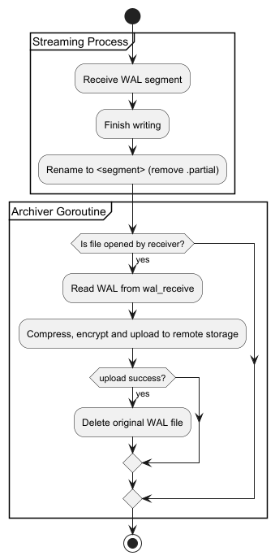

_`pgrwl` stream write-ahead logs from a PostgreSQL server_

[](https://github.com/hashmap-kz/pgrwl/blob/master/LICENSE)
[](https://goreportcard.com/report/github.com/hashmap-kz/pgrwl)
[](https://github.com/hashmap-kz/pgrwl/actions/workflows/ci.yml?query=branch:master)
[](https://github.com/hashmap-kz/pgrwl/issues)
[](https://github.com/hashmap-kz/pgrwl/blob/master/go.mod#L3)
[](https://github.com/hashmap-kz/pgrwl/releases/latest)

---

## 📚 Table of Contents

- [🚀 About](#-about)
- [🛠️ Usage](#-usage)
    - [Required Flags](#-required-flags)
    - [Optional Flags](#-optional-flags)
- [🚀 Installation](#-installation)
- [🗃️ Usage In Backup Process](#-usage-in-backup-process)
- [🧱 Architecture](#-architecture)
    - [Design Notes](#design-notes)
    - [Notes on `fsync`](#-notes-on-fsync-since-the-utility-works-in-synchronous-mode-only)
    - [Notes on `archive_command` and `archive_timeout`](#-notes-on-archive_command-and-archive_timeout)
- [👷 Developer Notes](#-developer-notes)
    - [Integration Testing](#-integration-testing)
    - [Verify build locally](#to-contribute-or-verify-the-project-locally-the-following-make-targets-should-all-pass)
    - [Source Code Structure](#-source-code-structure)
    - [Notes On Configuration](#notes-on-configuration)
    - [Main Loop Diagram](#-main-loop)
    - [Planned Features](#-planned-features)
    - [Links](#-links)
- [📜 License](#-license)

---

## 🚀 About

* The project serves as a **research platform** to explore streaming WAL archiving with a target of **RPO=0** during
  recovery.

* _It's primarily designed for use in containerized environments._

* The utility replicates all key features of `pg_receivewal`, including automatic reconnection on connection loss,
  streaming into partial files, extensive error checking and more.

* The tool is easy to install as a single binary and simple to debug - just use your preferred editor and a Docker
  container running PostgreSQL.

---

## 🛠️ Usage

### `Receive` mode (_the main loop of the WAL receiver_)

```bash
cat <<EOF >config.yml
main:
  listen_port: 7070
  directory: wals
receiver:
  slot: pgrwl_v5
log:
  level: trace
  format: text
  add_source: true
EOF

export PGHOST=localhost
export PGPORT=5432
export PGUSER=postgres
export PGPASSWORD=postgres
export PGRWL_MODE=receive

pgrwl -c config.yml
```

### `Serve` mode (_used during restore to serve archived WAL files from storage_)

```bash
cat <<EOF >config.yml
main:
  listen_port: 7070
  directory: wals
log:
  level: trace
  format: text
  add_source: true
EOF

export PGRWL_MODE=serve

pgrwl -c config.yml
```

### `restore_command` example for postgresql.conf

```
# where 'k8s-worker5:30266' represents the host and port of a 'pgrwl' instance running in 'serve' mode. 
restore_command = 'pgrwl restore-command --serve-addr=k8s-worker5:30266 %f %p'
```

⭐ **See also: [examples](examples) (step-by-step archive and recovery), and [k8s](k8s) (basic setup)**

--- 

## ⚙️ Configuration Reference

The configuration file is in JSON or YML format (*.json is preferred).
It supports environment variable placeholders like `${PGRWL_SECRET_ACCESS_KEY}`.

```
main:                                    # Required for both modes: 'receive' / 'serve'
  listen_port: 7070                      # HTTP server port (used for management)
  directory: "/var/lib/pgwal"            # Base directory for storing WAL files

receiver:                                # Required for 'receive' mode
  slot: replication_slot                 # Replication slot to use
  no_loop: false                         # If true, do not loop on connection loss

uploader:                                # Optional (used in receive mode)
  sync_interval: 10s                     # Interval for the upload worker to check for new files
  max_concurrency: 4                     # Maximum number of files to upload concurrently

log:                                     # Optional
  level: info                            # One of: trace / debug / info / warn / error
  format: text                           # One of: text / json
  add_source: true                       # Include file:line in log messages (for local development)

storage:                                 # Optional
  name: s3                               # One of: s3 / sftp
  compression:                           # Optional
    algo: gzip                           # One of: gzip / zstd
  encryption:                            # Optional
    algo: aesgcm                         # One of: aes-256-gcm
    pass: "${PGRWL_ENCRYPT_PASSWD}"      # Encryption password (from env)
  sftp:                                  # Required section for 'sftp' storage
    host: sftp.example.com               # SFTP server hostname
    port: 22                             # SFTP server port
    user: backupuser                     # SFTP username
    pass: "${PGRWL_VM_PASSWORD}"         # SFTP password (from env)
    pkey_path: "/home/user/.ssh/id_rsa"  # Path to SSH private key (optional)
    pkey_pass: "${PGRWL_SSH_PKEY_PASS}"  # Required if the private key is password-protected
  s3:                                    # Required section for 's3' storage
    url: https://s3.example.com          # S3-compatible endpoint URL
    access_key_id: AKIAEXAMPLE           # AWS access key ID
    secret_access_key: "${PGRWL_AWS_SK}" # AWS secret access key (from env)
    bucket: postgres-backups             # Target S3 bucket name
    region: us-east-1                    # S3 region
    use_path_style: true                 # Use path-style URLs for S3
    disable_ssl: false                   # Disable SSL
```

---

## 🚀 Installation

### Manual Installation

1. Download the latest binary for your platform from
   the [Releases page](https://github.com/hashmap-kz/pgrwl/releases).
2. Place the binary in your system's `PATH` (e.g., `/usr/local/bin`).

### Installation script for Unix-Based OS _(requires: tar, curl, jq)_:

```bash
(
set -euo pipefail

OS="$(uname | tr '[:upper:]' '[:lower:]')"
ARCH="$(uname -m | sed -e 's/x86_64/amd64/' -e 's/\(arm\)\(64\)\?.*/\1\2/' -e 's/aarch64$/arm64/')"
TAG="$(curl -s https://api.github.com/repos/hashmap-kz/pgrwl/releases/latest | jq -r .tag_name)"

curl -L "https://github.com/hashmap-kz/pgrwl/releases/download/${TAG}/pgrwl_${TAG}_${OS}_${ARCH}.tar.gz" |
tar -xzf - -C /usr/local/bin && \
chmod +x /usr/local/bin/pgrwl
)
```

### Package-Based installation (suitable in CI/CD)

#### Debian 

```
sudo apt update -y && sudo apt install -y curl
curl -LO https://github.com/hashmap-kz/pgrwl/releases/latest/download/pgrwl_linux_amd64.deb
sudo dpkg -i pgrwl_linux_amd64.deb
```

#### Apline Linux

```
apk update && apk add --no-cache bash curl
curl -LO https://github.com/hashmap-kz/pgrwl/releases/latest/download/pgrwl_linux_amd64.apk
apk add pgrwl_linux_amd64.apk --allow-untrusted
```

--- 

## 🗃️ Usage In Backup Process

_The full process may look like this (a typical, rough, and simplified example):_

- You have a cron job that performs a _base backup_ of your cluster every three days.
- You run `pgrwl` as a systemd unit or a Kubernetes pod (depending on your infrastructure).
- You have a cron job that prunes WAL files older than three days.
- With this setup, you're able to restore your cluster - in the event of a crash - to any second within the past three
  days.

---

## 🧱 Architecture

### Design Notes

`pgrwl` is designed to use the local filesystem exclusively. This is a deliberate choice, because - as mentioned
earlier - we must rely on fsync after each message is written to disk.
This ensures that `*.partial` files always contain fully valid WAL segments, making them safe to use during the restore
phase (after simply removing the `*.partial` suffix).

I'm considering adding support for compression and encryption as optional features for completed WAL files.
However, streaming `*.partial` files to any location other than the local filesystem can introduce numerous
unpredictable issues.

In short: PostgreSQL waits for the replica to confirm commits, so we cannot afford to depend on external systems in such
critical paths.

### 💾 Notes on `fsync` (since the utility works in synchronous mode **only**):

* After each WAL segment is written, an `fsync` is performed on the currently open WAL file to ensure durability.
* An `fsync` is triggered when a WAL segment is completed and the `*.partial` file is renamed to its final form.
* An `fsync` is triggered when a keepalive message is received from the server with the `reply_requested` option set.
* Additionally, `fsync` is called whenever an error occurs during the receive-copy loop.

### 🔁 Notes on `archive_command` and `archive_timeout`

There’s a significant difference between using `archive_command` and archiving WAL files via the streaming replication
protocol.

The `archive_command` is triggered only after a WAL file is fully completed—typically when it reaches 16 MiB (the
default segment size).
This means that in a crash scenario, you could lose up to 16 MiB of data.

You can mitigate this by setting a lower `archive_timeout` (e.g., 1 minute), but even then, in a worst-case scenario,
you risk losing up to 1 minute of data.
Also, it’s important to note that PostgreSQL preallocates WAL files to the configured `wal_segment_size`, so they are
created with full size regardless of how much data has been written. (Quote from documentation:
_It is therefore unwise to set a very short `archive_timeout` — it will bloat your archive storage._).

In contrast, streaming WAL archiving—when used with replication slots and the `synchronous_standby_names`
parameter—ensures that the system can be restored to the latest committed transaction.
This approach provides true zero data loss (**RPO=0**), making it ideal for high-durability requirements.

---

## 👷 Developer Notes

### 🧪 Integration Testing:

Here and example of a 'golden' fundamental test.
It verifies that we can restore to the latest committed transaction after an abrupt system crash.
It also checks that the WAL files generated are byte-for-byte identical to those generated by `pg_receivewal`.

#### Test Steps:

* Initialize and start a PostgreSQL cluster
* Run WAL receivers (`pgrwl` and `pg_receivewal`)
* Create a base backup
* Create a table, and insert the current timestamp every second (in the background)
* Run pgbench to populate the database with 1 million rows
* Generate additional data (~512 MiB)
* Concurrently create 100 tables with 10000 rows each.
* Terminate the insert-script job
* Run pg_dumpall and save the output as plain SQL
* Terminate all PostgreSQL processes and delete the `PGDATA` directory (termination is force and abnormal)
* Restore `PGDATA` from the base backup, add recovery.signal, and configure restore_command
* Rename all `*.partial` WAL files in the WAL archive directories
* Start the PostgreSQL cluster (cluster should recover to the latest committed transaction)
* Run pg_dumpall after the cluster is ready
* Diff the pg_dumpall results (before and after)
* Check the insert-script logs and verify that the table contains the last inserted row
* Compare WAL directories (filenames and contents must match 100%)
* Clean up WAL directories and rerun the WAL archivers on a new timeline (cleanup is necessary since we run receivers
  with --no-loop option)
* Compare the WAL directories again

### To contribute or verify the project locally, the following `make` targets should all pass:

```
# Compile the project
make build

# Run linter (should pass without errors)
make lint

# Run unit tests (should all pass)
make test

# Run integration tests (slow, but critical)
# Requires Docker and Docker Compose to be installed
make test-integ-scripts

# Run GoReleaser builds locally
make snapshot
```

✅ All targets should complete successfully before submitting changes or opening a PR.

### 🗂️ Source Code Structure

```
internal/xlog/pg_receivewal.go
  → Entry point for WAL receiving logic.
    Based on the logic found in PostgreSQL:
    https://github.com/postgres/postgres/blob/master/src/bin/pg_basebackup/pg_receivewal.c

internal/xlog/receivelog.go
  → Core streaming loop and replication logic.
    Based on the logic found in PostgreSQL: 
    https://github.com/postgres/postgres/blob/master/src/bin/pg_basebackup/receivelog.c

internal/xlog/xlog_internal.go
  → Helpers for LSN math, WAL file naming, segment calculations.
    Based on the logic found in PostgreSQL:
    https://github.com/postgres/postgres/blob/master/src/include/access/xlog_internal.h

internal/xlog/walfile.go
  → Manages WAL file descriptors: open, write, close, sync.

internal/xlog/streamutil.go
  → Utilities for querying server parameters (e.g. wal_segment_size),
    replication slot info, and streaming setup.

internal/xlog/fsync/
  → Optimized wrappers for safe and efficient `fsync` system calls.
```

### 📐 Main Loop



### 🛠 Planned Features

- Download all WAL files
- [X] Concurrent batch-uploads
- Metrics, alerting
- Retention loop (configured: i.e.: retention_period = 3d, and triggered: i.e.: /api/v1/retention)

### ⏮️ Links

- [pg_receivewal Documentation](https://www.postgresql.org/docs/current/app-pgrwl.html)
- [pg_receivewal Source Code](https://github.com/postgres/postgres/blob/master/src/bin/pg_basebackup/pg_receivewal.c)
- [Streaming Replication Protocol](https://www.postgresql.org/docs/current/protocol-replication.html)
- [Continuous Archiving and Point-in-Time Recovery](https://www.postgresql.org/docs/current/continuous-archiving.html)
- [Setting Up WAL Archiving](https://www.postgresql.org/docs/current/continuous-archiving.html#BACKUP-ARCHIVING-WAL)

---

## 📜 License

MIT License. See [LICENSE](./LICENSE) for details.
